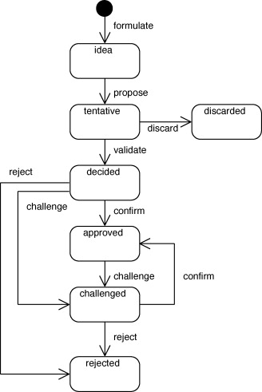

# TITLE HERE

Date: YYYY-MM-DD

## Name

> A short name of the decision that serves as a key in the other views.

## Current Version

> ?? 

## Current state

> The current state of the decision. Please refer to Fig. C.3 for a list of all possible decision states.

Downloaded 1/26/2022 from : https://ars.els-cdn.com/content/image/1-s2.0-S0164121211002755-gr11.jpg

WHAT ARE STATUSES?

- Proposed, Accepted, Deprecated, Superseded (https://resources.sei.cmu.edu/asset_files/Presentation/2017_017_001_497746.pdf)

## Decision groups

> A decision can be associated to one or more groups, which share specific characteristics. Decisions could for instance be grouped by subsystem, architecture team who made the decision, or quality attribute requirements. The concept of a decision group is equal to the group concept in Tyree and Akerman's decision template (Tyree and Akerman, 2005), and the decision categories in Kruchten's ontology (Kruchten, 2004).

## Problem/issue

> The circumstances under which the architect felt the need to make a decision among one or more alternatives. In other words, the issue addressed by the decision.

## Decision

> The outcome of the decision. In other templates this element is called _solution_.

## Alternatives

> The alternative solutions considered when making the decision.

### Alternative 1

> Describe

### Alternative 2

> Describe

## Arguments

> ??

## Related Decisions

> All decisions that have a relationship to the decision. The available relationship types are defined in Appendix C.2.

| Decision | Relation  | Decision |
|----------|-----------|----------|
| this     | caused by | 0001-foo |

- use "this" to refer to this decision document
- use the "name" of another decision document to refer to any other decision
- for Relation see ./docs/decision.relations.md

## History

> The history of the described decision. The history contains all state changes, i.e., when the decision was proposed, decided, approved and so on.

| Stakeholder | Role      | Date       
| Action | Status | Iteration |
|-------------|-----------|------------|--------|--------|-----------|
| M. Mouse    | Architect | 1970-01-01 | Action | Status | Iteration |

- For role see ./docs/stakeholder-roles.md
- For action see ./docs/decision-stakeholder-actions.md
- For status see ./docs/architectural-decision-states.md
- for iteration ... ???

## References

- [alternative 1](https://www.example.com/)
- [alternative 2](https://www.example.com/)